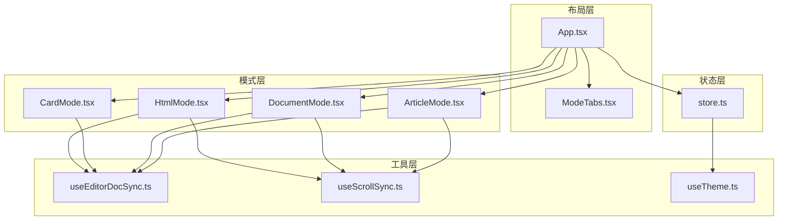
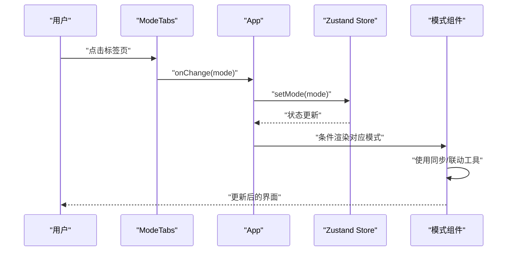
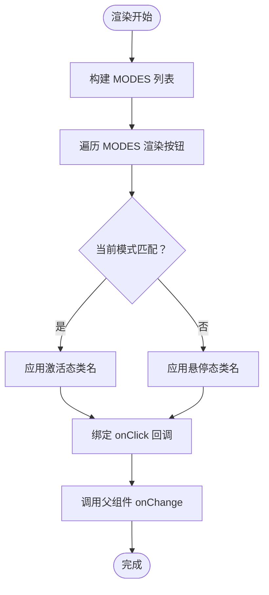
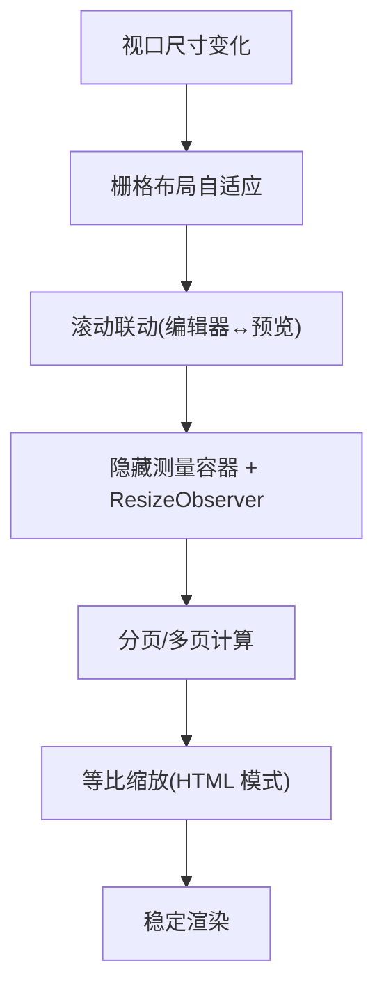
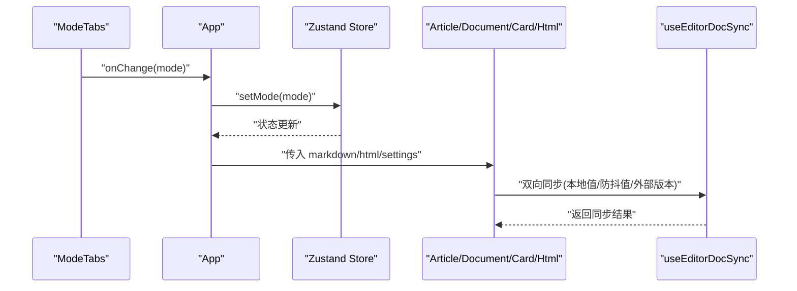
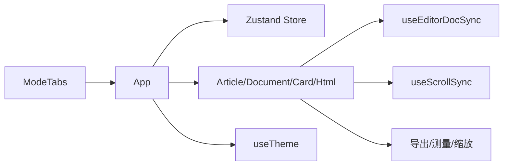

# 布局组件

<cite>
**本文引用的文件**
- [ModeTabs.tsx](file://src/components/layout/ModeTabs.tsx)
- [App.tsx](file://src/App.tsx)
- [store.ts](file://src/lib/store.ts)
- [useEditorDocSync.ts](file://src/lib/useEditorDocSync.ts)
- [useScrollSync.ts](file://src/lib/useScrollSync.ts)
- [ArticleMode.tsx](file://src/modes/article/ArticleMode.tsx)
- [CardMode.tsx](file://src/modes/card/CardMode.tsx)
- [DocumentMode.tsx](file://src/modes/document/DocumentMode.tsx)
- [HtmlMode.tsx](file://src/modes/html/HtmlMode.tsx)
- [useTheme.ts](file://src/engine/composables/useTheme.ts)
- [package.json](file://package.json)
</cite>

## 目录
1. [简介](#简介)
2. [项目结构](#项目结构)
3. [核心组件](#核心组件)
4. [架构总览](#架构总览)
5. [详细组件分析](#详细组件分析)
6. [依赖分析](#依赖分析)
7. [性能考虑](#性能考虑)
8. [故障排查指南](#故障排查指南)
9. [结论](#结论)
10. [附录](#附录)

## 简介
本文件聚焦于布局组件中的标签页系统 ModeTabs，系统性阐述其动态标签生成、标签切换动画与状态管理机制；同时结合应用顶层布局 App，说明响应式设计在不同屏幕尺寸下的适配策略，以及与各模式组件（文章、文档、卡片、HTML）之间的协作关系、数据传递与事件处理机制。文档还提供定制化选项建议（标签样式、图标配置、交互行为）、可访问性设计要点（键盘导航、屏幕阅读器支持）、性能优化技巧与最佳实践，并给出扩展开发的 API 参考与使用示例。

## 项目结构
本项目采用按功能域划分的目录组织方式，布局组件位于 src/components/layout，模式组件位于 src/modes，全局状态管理位于 src/lib，主题与颜色工具位于 src/engine/composables。ModeTabs 作为顶层导航的一部分，与 App 一起协调多个渲染模式的工作台布局。

**图表来源**
- [App.tsx:35-171](file://src/App.tsx#L35-L171)
- [ModeTabs.tsx:15-41](file://src/components/layout/ModeTabs.tsx#L15-L41)
- [store.ts:54-92](file://src/lib/store.ts#L54-L92)
- [ArticleMode.tsx:16-54](file://src/modes/article/ArticleMode.tsx#L16-L54)
- [DocumentMode.tsx:34-344](file://src/modes/document/DocumentMode.tsx#L34-L344)
- [CardMode.tsx:44-363](file://src/modes/card/CardMode.tsx#L44-L363)
- [HtmlMode.tsx:92-578](file://src/modes/html/HtmlMode.tsx#L92-L578)
- [useEditorDocSync.ts:20-49](file://src/lib/useEditorDocSync.ts#L20-L49)
- [useScrollSync.ts:7-67](file://src/lib/useScrollSync.ts#L7-L67)
- [useTheme.ts:13-67](file://src/engine/composables/useTheme.ts#L13-L67)

**章节来源**
- [App.tsx:35-171](file://src/App.tsx#L35-L171)
- [ModeTabs.tsx:15-41](file://src/components/layout/ModeTabs.tsx#L15-L41)
- [store.ts:54-92](file://src/lib/store.ts#L54-L92)

## 核心组件
- ModeTabs：提供四种渲染模式的标签页切换入口，负责根据当前模式高亮激活项，并通过回调触发全局状态变更。
- App：顶层容器，聚合状态、主题、导航与各模式组件，负责模式切换与内容渲染。
- 模式组件：ArticleMode、DocumentMode、CardMode、HtmlMode 分别承载对应模式的编辑与预览区域，内部使用同步工具与滚动联动工具提升体验。
- 状态与主题：store.ts 提供全局状态与持久化；useTheme.ts 提供主题色与颜色体系。

**章节来源**
- [ModeTabs.tsx:15-41](file://src/components/layout/ModeTabs.tsx#L15-L41)
- [App.tsx:35-171](file://src/App.tsx#L35-L171)
- [store.ts:54-92](file://src/lib/store.ts#L54-L92)
- [useTheme.ts:13-67](file://src/engine/composables/useTheme.ts#L13-L67)

## 架构总览
ModeTabs 与 App 的协作流程如下：用户点击标签页 -> ModeTabs 调用 onChange -> App 使用 Zustand 更新 mode -> App 条件渲染对应模式组件 -> 模式组件内部通过同步与联动工具维持编辑器与预览的协同。

**图表来源**
- [ModeTabs.tsx:29](file://src/components/layout/ModeTabs.tsx#L29)
- [App.tsx:90](file://src/App.tsx#L90)
- [store.ts:215-220](file://src/lib/store.ts#L215-L220)

## 详细组件分析

### ModeTabs 标签页系统
- 动态标签生成：MODES 数组定义可用模式与标签文本，ModeTabs 遍历渲染按钮列表，键值为模式键，标题为标签文本。
- 标签切换逻辑：每个按钮绑定 onClick，回调将目标模式传给父组件，父组件负责更新全局状态。
- 样式与动画：使用 Tailwind 类控制圆角、内边距、过渡时间与阴影，激活态与悬停态通过类名切换实现平滑过渡。
- 可访问性：按钮具备 title 属性，便于屏幕阅读器读取；建议进一步增加 aria-selected、role 等属性以增强无障碍体验。

**图表来源**
- [ModeTabs.tsx:8-13](file://src/components/layout/ModeTabs.tsx#L8-L13)
- [ModeTabs.tsx:24-38](file://src/components/layout/ModeTabs.tsx#L24-L38)
- [ModeTabs.tsx:29](file://src/components/layout/ModeTabs.tsx#L29)

**章节来源**
- [ModeTabs.tsx:8-13](file://src/components/layout/ModeTabs.tsx#L8-L13)
- [ModeTabs.tsx:24-38](file://src/components/layout/ModeTabs.tsx#L24-L38)
- [ModeTabs.tsx:29](file://src/components/layout/ModeTabs.tsx#L29)

### 响应式设计与布局适配
- 容器与网格：各模式组件普遍采用基于 Tailwind 的栅格布局（例如 grid-cols-2、min-h-0、flex-col 等），在不同屏幕尺寸下保持内容区域自适应。
- 滚动与同步：useScrollSync 在编辑器与预览之间建立滚动联动，减少滚动冲突，提升阅读与编辑一致性。
- HTML 模式多页自适应：HtmlMode 在多页模式下通过计算可视页尺寸并设置缩放比例，实现窗口变化时的等比缩放与稳定呈现。
- 文档模式测量与分页：DocumentMode 使用隐藏测量容器与 ResizeObserver 获取块高度，结合分页算法生成 A4 页面，保证打印与导出质量。

**图表来源**
- [ArticleMode.tsx:32-51](file://src/modes/article/ArticleMode.tsx#L32-L51)
- [DocumentMode.tsx:67-125](file://src/modes/document/DocumentMode.tsx#L67-L125)
- [HtmlMode.tsx:253-344](file://src/modes/html/HtmlMode.tsx#L253-L344)
- [useScrollSync.ts:7-67](file://src/lib/useScrollSync.ts#L7-L67)

**章节来源**
- [ArticleMode.tsx:32-51](file://src/modes/article/ArticleMode.tsx#L32-L51)
- [DocumentMode.tsx:67-125](file://src/modes/document/DocumentMode.tsx#L67-L125)
- [HtmlMode.tsx:253-344](file://src/modes/html/HtmlMode.tsx#L253-L344)
- [useScrollSync.ts:7-67](file://src/lib/useScrollSync.ts#L7-L67)

### 与系统组件的协作关系
- 数据传递：App 通过 useStore 选择性订阅状态，将 markdown/html 与设置传递给对应模式组件；模式组件内部再通过 useEditorDocSync 与 store 同步。
- 事件处理：ModeTabs 的 onChange 与 App 的 setMode 形成事件链；各模式组件内部通过 useEffect 与事件监听（如滚动、键盘、滚轮）实现交互。
- 主题与颜色：App 与 store 负责主题色持久化与 CSS 变量注入，渲染引擎使用 useTheme 生成颜色体系。

**图表来源**
- [ModeTabs.tsx:29](file://src/components/layout/ModeTabs.tsx#L29)
- [App.tsx:90](file://src/App.tsx#L90)
- [store.ts:215-220](file://src/lib/store.ts#L215-L220)
- [useEditorDocSync.ts:20-49](file://src/lib/useEditorDocSync.ts#L20-L49)

**章节来源**
- [App.tsx:35-171](file://src/App.tsx#L35-L171)
- [store.ts:54-92](file://src/lib/store.ts#L54-L92)
- [useEditorDocSync.ts:20-49](file://src/lib/useEditorDocSync.ts#L20-L49)

### 定制化选项
- 标签样式：可通过修改 ModeTabs 的类名组合（圆角、内边距、过渡时长、阴影）实现不同风格；建议将常用样式抽离为变量或主题配置。
- 图标配置：当前标签页未包含图标；可在 MODES 中扩展图标字段并在渲染时插入图标元素，或通过外部图标库组件注入。
- 交互行为：可扩展 ModeTabs 支持键盘导航（左右箭头切换）、触屏手势（滑动切换）等；建议增加 aria-* 属性与无障碍语义。
- 模式扩展：新增模式时只需在 MODES 中添加条目，并在 App 的条件渲染分支中接入新组件即可。

**章节来源**
- [ModeTabs.tsx:8-13](file://src/components/layout/ModeTabs.tsx#L8-L13)
- [App.tsx:134-165](file://src/App.tsx#L134-L165)

### 可访问性设计
- 键盘导航：HtmlMode 已实现键盘翻页（方向键），建议在 ModeTabs 中增加 Tab/Shift+Tab 切换与 Enter/Space 激活能力，并设置 aria-selected、aria-controls。
- 屏幕阅读器：按钮具备 title 属性；建议补充 role="tablist"、role="tab"、aria-selected 等属性，确保读屏软件正确识别状态。
- 对比度与焦点：确保激活态与悬停态的颜色对比度满足 WCAG 要求，提供可见焦点指示。

**章节来源**
- [HtmlMode.tsx:175-213](file://src/modes/html/HtmlMode.tsx#L175-L213)
- [ModeTabs.tsx:27-36](file://src/components/layout/ModeTabs.tsx#L27-L36)

### 性能优化与最佳实践
- 防抖与去抖：useEditorDocSync 对编辑输入进行防抖回写，降低写入频率与竞态风险。
- 滚动联动：useScrollSync 采用“主导方”策略，避免相互拉扯与重复滚动事件，提高流畅度。
- 懒加载与骨架：App 使用 Suspense 与 lazy 加载模式组件，减少首屏负载。
- 测量与分页：DocumentMode 的隐藏测量容器与 ResizeObserver 仅在必要时触发，避免主线程阻塞。
- HTML 模式缩放：HtmlMode 在窗口变化时延迟与节流处理，配合请求帧稳定缩放。

**章节来源**
- [useEditorDocSync.ts:15-49](file://src/lib/useEditorDocSync.ts#L15-L49)
- [useScrollSync.ts:3-67](file://src/lib/useScrollSync.ts#L3-L67)
- [App.tsx:13-16](file://src/App.tsx#L13-L16)
- [DocumentMode.tsx:67-125](file://src/modes/document/DocumentMode.tsx#L67-L125)
- [HtmlMode.tsx:253-344](file://src/modes/html/HtmlMode.tsx#L253-L344)

### 扩展开发 API 参考与示例
- ModeTabs API
  - 参数
    - mode: RenderMode（当前激活模式）
    - onChange: (mode: RenderMode) => void（切换回调）
  - 行为：渲染固定模式列表，点击触发 onChange；激活态与非激活态样式区分。
  - 示例路径：[ModeTabs.tsx:15-41](file://src/components/layout/ModeTabs.tsx#L15-L41)
- App 与状态集成
  - 使用 useStore 获取/更新 mode 与各模式内容；通过 setMode 切换模式。
  - 示例路径：[App.tsx:47-48](file://src/App.tsx#L47-L48)、[store.ts:215-220](file://src/lib/store.ts#L215-L220)
- 模式组件通用模式
  - ArticleMode/DocumentMode/CardMode/HtmlMode 均采用“本地值-防抖值-回写 store”的双向同步模式，编辑器 ready 后建立滚动联动。
  - 示例路径：
    - [ArticleMode.tsx:16-30](file://src/modes/article/ArticleMode.tsx#L16-L30)
    - [DocumentMode.tsx:34-61](file://src/modes/document/DocumentMode.tsx#L34-L61)
    - [CardMode.tsx:44-66](file://src/modes/card/CardMode.tsx#L44-L66)
    - [HtmlMode.tsx:92-110](file://src/modes/html/HtmlMode.tsx#L92-L110)
- 同步与联动工具
  - useEditorDocSync：提供 localValue、debouncedValue、externalVersion，避免回写回声与冗余写入。
    - 示例路径：[useEditorDocSync.ts:20-49](file://src/lib/useEditorDocSync.ts#L20-L49)
  - useScrollSync：建立两个容器的滚动联动，采用主导方策略。
    - 示例路径：[useScrollSync.ts:7-67](file://src/lib/useScrollSync.ts#L7-L67)
- 主题与颜色
  - THEMES 提供预设主题色；makeColors 生成颜色体系；App 通过 setTheme 注入 CSS 变量。
    - 示例路径：[useTheme.ts:13-67](file://src/engine/composables/useTheme.ts#L13-L67)、[store.ts:227-230](file://src/lib/store.ts#L227-L230)

**章节来源**
- [ModeTabs.tsx:15-41](file://src/components/layout/ModeTabs.tsx#L15-L41)
- [App.tsx:47-48](file://src/App.tsx#L47-L48)
- [store.ts:215-220](file://src/lib/store.ts#L215-L220)
- [ArticleMode.tsx:16-30](file://src/modes/article/ArticleMode.tsx#L16-L30)
- [DocumentMode.tsx:34-61](file://src/modes/document/DocumentMode.tsx#L34-L61)
- [CardMode.tsx:44-66](file://src/modes/card/CardMode.tsx#L44-L66)
- [HtmlMode.tsx:92-110](file://src/modes/html/HtmlMode.tsx#L92-L110)
- [useEditorDocSync.ts:20-49](file://src/lib/useEditorDocSync.ts#L20-L49)
- [useScrollSync.ts:7-67](file://src/lib/useScrollSync.ts#L7-L67)
- [useTheme.ts:13-67](file://src/engine/composables/useTheme.ts#L13-L67)
- [store.ts:227-230](file://src/lib/store.ts#L227-L230)

## 依赖分析
- ModeTabs 依赖 App 传入的 mode 与 onChange，不直接依赖状态存储，职责单一。
- App 依赖 Zustand store 提供的 mode 与 setMode，同时依赖各模式组件懒加载与主题工具。
- 模式组件共享 useEditorDocSync 与 useScrollSync，形成稳定的编辑-预览协同机制。
- HtmlMode 依赖多页检测与导出工具，具备复杂的缩放与翻页逻辑。

**图表来源**
- [ModeTabs.tsx:15-41](file://src/components/layout/ModeTabs.tsx#L15-L41)
- [App.tsx:35-171](file://src/App.tsx#L35-L171)
- [store.ts:54-92](file://src/lib/store.ts#L54-L92)
- [useEditorDocSync.ts:20-49](file://src/lib/useEditorDocSync.ts#L20-L49)
- [useScrollSync.ts:7-67](file://src/lib/useScrollSync.ts#L7-L67)
- [useTheme.ts:13-67](file://src/engine/composables/useTheme.ts#L13-L67)

**章节来源**
- [ModeTabs.tsx:15-41](file://src/components/layout/ModeTabs.tsx#L15-L41)
- [App.tsx:35-171](file://src/App.tsx#L35-L171)
- [store.ts:54-92](file://src/lib/store.ts#L54-L92)
- [useEditorDocSync.ts:20-49](file://src/lib/useEditorDocSync.ts#L20-L49)
- [useScrollSync.ts:7-67](file://src/lib/useScrollSync.ts#L7-L67)
- [useTheme.ts:13-67](file://src/engine/composables/useTheme.ts#L13-L67)

## 性能考虑
- 减少重绘与回流：ModeTabs 使用类名切换而非频繁 DOM 修改；各模式组件采用最小化状态更新与 memo 化（如 useMemo）。
- 防抖与节流：useEditorDocSync 与 HtmlMode 的缩放处理均采用防抖/节流策略，避免高频操作引发性能问题。
- 懒加载与骨架：App 对模式组件使用懒加载与 Suspense，降低首屏渲染压力。
- 测量与观察者：DocumentMode 的 ResizeObserver 仅在内容变化时触发，避免主线程持续占用。

**章节来源**
- [useEditorDocSync.ts:15-49](file://src/lib/useEditorDocSync.ts#L15-L49)
- [HtmlMode.tsx:253-344](file://src/modes/html/HtmlMode.tsx#L253-L344)
- [DocumentMode.tsx:67-125](file://src/modes/document/DocumentMode.tsx#L67-L125)
- [App.tsx:13-16](file://src/App.tsx#L13-L16)

## 故障排查指南
- 标签页无响应
  - 检查 ModeTabs 的 onChange 是否正确传入 App 的 setMode；确认 App 的 mode 状态是否更新。
  - 参考路径：[ModeTabs.tsx:29](file://src/components/layout/ModeTabs.tsx#L29)、[App.tsx:90](file://src/App.tsx#L90)、[store.ts:215-220](file://src/lib/store.ts#L215-L220)
- 编辑器与预览不同步
  - 确认 useScrollSync 的两个容器引用已正确传入；检查 editorReady 是否递增以触发联动。
  - 参考路径：[useScrollSync.ts:7-67](file://src/lib/useScrollSync.ts#L7-L67)、[ArticleMode.tsx:30](file://src/modes/article/ArticleMode.tsx#L30)
- 防抖回写异常或丢失字符
  - 检查 useEditorDocSync 的 externalVersion 是否正确递增以触发编辑器覆盖；确认 lastWrittenRef 未被意外重置。
  - 参考路径：[useEditorDocSync.ts:20-49](file://src/lib/useEditorDocSync.ts#L20-L49)
- HTML 模式多页翻页无效
  - 检查 pages 是否正确检测；确认键盘/滚轮事件未被输入框捕获；验证当前页索引边界。
  - 参考路径：[HtmlMode.tsx:115-173](file://src/modes/html/HtmlMode.tsx#L115-L173)、[HtmlMode.tsx:175-213](file://src/modes/html/HtmlMode.tsx#L175-L213)
- 文档模式分页错位
  - 检查隐藏测量容器的尺寸与字体设置；确认 ResizeObserver 与图片加载事件已正确注册。
  - 参考路径：[DocumentMode.tsx:67-125](file://src/modes/document/DocumentMode.tsx#L67-L125)

**章节来源**
- [ModeTabs.tsx:29](file://src/components/layout/ModeTabs.tsx#L29)
- [App.tsx:90](file://src/App.tsx#L90)
- [store.ts:215-220](file://src/lib/store.ts#L215-L220)
- [useScrollSync.ts:7-67](file://src/lib/useScrollSync.ts#L7-L67)
- [ArticleMode.tsx:30](file://src/modes/article/ArticleMode.tsx#L30)
- [useEditorDocSync.ts:20-49](file://src/lib/useEditorDocSync.ts#L20-L49)
- [HtmlMode.tsx:115-173](file://src/modes/html/HtmlMode.tsx#L115-L173)
- [HtmlMode.tsx:175-213](file://src/modes/html/HtmlMode.tsx#L175-L213)
- [DocumentMode.tsx:67-125](file://src/modes/document/DocumentMode.tsx#L67-L125)

## 结论
ModeTabs 以简洁的结构实现了模式切换的核心功能，配合 App 的状态管理与各模式组件的同步/联动工具，形成了高效、可扩展的布局与工作台体系。通过合理的响应式设计、性能优化与可访问性增强，系统在多场景渲染任务中具备良好的用户体验与维护性。未来可在无障碍、图标与交互行为方面进一步完善，并通过扩展 MODES 与模式组件接口支持更多渲染模式。

## 附录
- 依赖清单（部分）
  - React、Zustand、CodeMirror、TailwindCSS 等
  - 参考路径：[package.json:13-31](file://package.json#L13-L31)

**章节来源**
- [package.json:13-31](file://package.json#L13-L31)