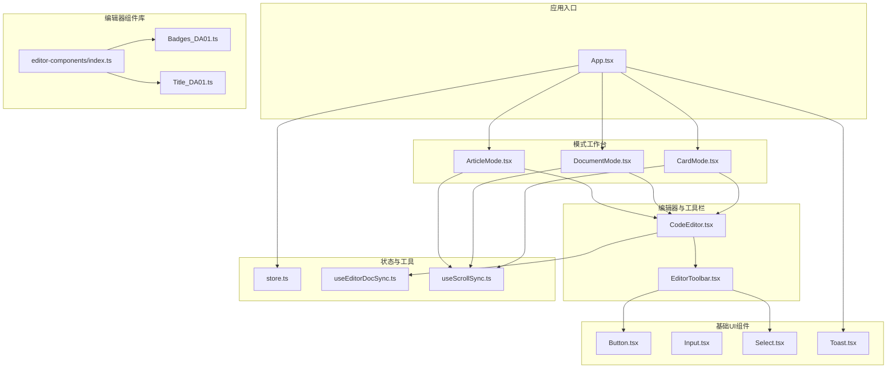
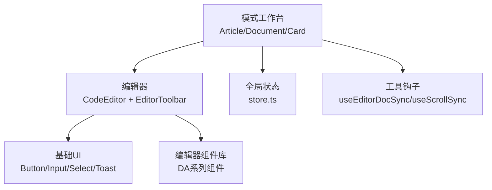
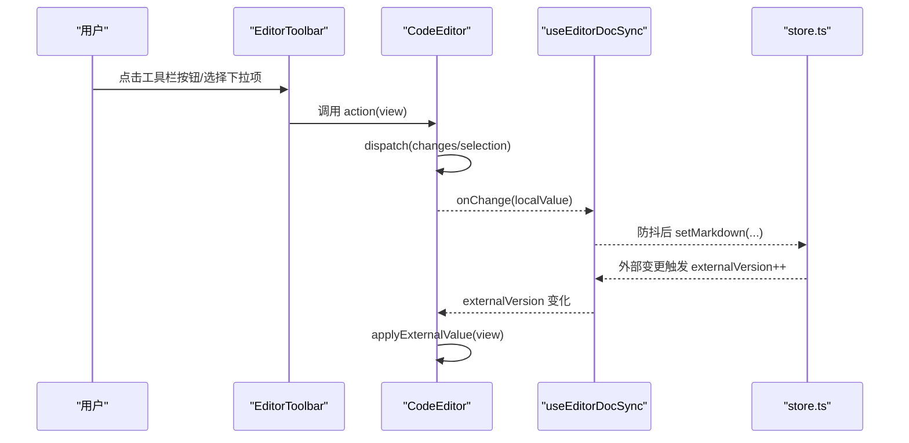
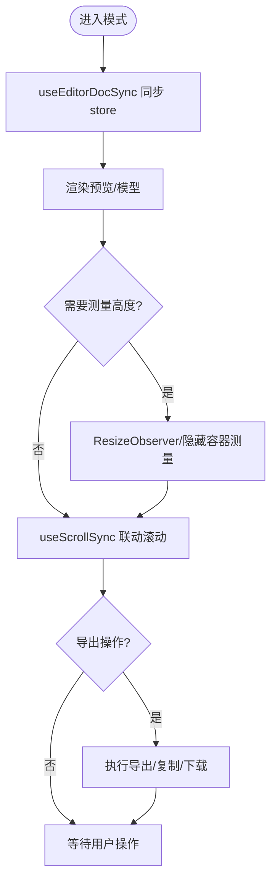
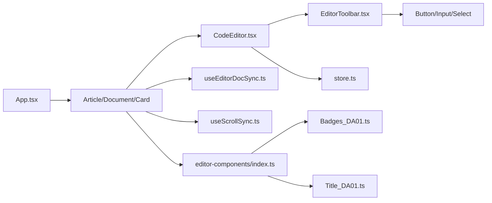

# 组件系统设计

<cite>
**本文引用的文件**
- [src/components/ui/Button.tsx](file://src/components/ui/Button.tsx)
- [src/components/ui/Input.tsx](file://src/components/ui/Input.tsx)
- [src/components/ui/Select.tsx](file://src/components/ui/Select.tsx)
- [src/components/ui/Toast.tsx](file://src/components/ui/Toast.tsx)
- [src/components/editor/CodeEditor.tsx](file://src/components/editor/CodeEditor.tsx)
- [src/components/editor/EditorToolbar.tsx](file://src/components/editor/EditorToolbar.tsx)
- [src/engine/editor-components/index.ts](file://src/engine/editor-components/index.ts)
- [src/engine/editor-components/Badges_DA01.ts](file://src/engine/editor-components/Badges_DA01.ts)
- [src/engine/editor-components/Title_DA01.ts](file://src/engine/editor-components/Title_DA01.ts)
- [src/lib/store.ts](file://src/lib/store.ts)
- [src/lib/useEditorDocSync.ts](file://src/lib/useEditorDocSync.ts)
- [src/lib/useScrollSync.ts](file://src/lib/useScrollSync.ts)
- [src/App.tsx](file://src/App.tsx)
- [src/modes/article/ArticleMode.tsx](file://src/modes/article/ArticleMode.tsx)
- [src/modes/card/CardMode.tsx](file://src/modes/card/CardMode.tsx)
- [src/modes/document/DocumentMode.tsx](file://src/modes/document/DocumentMode.tsx)
</cite>

## 目录
1. [简介](#简介)
2. [项目结构](#项目结构)
3. [核心组件](#核心组件)
4. [架构总览](#架构总览)
5. [详细组件分析](#详细组件分析)
6. [依赖关系分析](#依赖关系分析)
7. [性能考量](#性能考量)
8. [故障排查指南](#故障排查指南)
9. [结论](#结论)
10. [附录](#附录)

## 简介
本文件面向 Markdown2View 的组件系统设计，系统以“分层组件 + 编辑器组件库”的方式组织，分为基础 UI 组件层（Button、Input、Select、Toast）与复合组件层（编辑器 CodeEditor、工具栏 EditorToolbar、各模式工作台）。编辑器组件库采用 DA 系列命名规范，提供可配置的富文本/卡片组件，支持通过属性与主题变量渲染为可直接粘贴的 HTML。组件系统强调可复用性、可组合性与可扩展性，通过 props 接口、事件处理与样式系统集成实现一致的交互体验，并通过全局状态与工具函数实现跨组件的数据传递与生命周期管理。

## 项目结构
组件系统主要分布在以下目录：
- 基础 UI 组件：src/components/ui
- 编辑器与工具栏：src/components/editor
- 编辑器组件库：src/engine/editor-components
- 全局状态：src/lib/store.ts
- 工具钩子：src/lib/useEditorDocSync.ts、src/lib/useScrollSync.ts
- 模式工作台：src/modes/{article, card, document}



图表来源
- [src/App.tsx:1-172](file://src/App.tsx#L1-L172)
- [src/components/editor/CodeEditor.tsx:1-245](file://src/components/editor/CodeEditor.tsx#L1-L245)
- [src/components/editor/EditorToolbar.tsx:1-153](file://src/components/editor/EditorToolbar.tsx#L1-L153)
- [src/engine/editor-components/index.ts:1-81](file://src/engine/editor-components/index.ts#L1-L81)
- [src/lib/store.ts:1-242](file://src/lib/store.ts#L1-L242)
- [src/lib/useEditorDocSync.ts:1-50](file://src/lib/useEditorDocSync.ts#L1-L50)
- [src/lib/useScrollSync.ts:1-68](file://src/lib/useScrollSync.ts#L1-L68)
- [src/modes/article/ArticleMode.tsx:1-55](file://src/modes/article/ArticleMode.tsx#L1-L55)
- [src/modes/document/DocumentMode.tsx:1-345](file://src/modes/document/DocumentMode.tsx#L1-L345)
- [src/modes/card/CardMode.tsx:1-364](file://src/modes/card/CardMode.tsx#L1-L364)

章节来源
- [src/App.tsx:1-172](file://src/App.tsx#L1-L172)
- [src/components/ui/Button.tsx:1-35](file://src/components/ui/Button.tsx#L1-L35)
- [src/components/ui/Input.tsx:1-14](file://src/components/ui/Input.tsx#L1-L14)
- [src/components/ui/Select.tsx:1-14](file://src/components/ui/Select.tsx#L1-L14)
- [src/components/ui/Toast.tsx:1-34](file://src/components/ui/Toast.tsx#L1-L34)
- [src/components/editor/CodeEditor.tsx:1-245](file://src/components/editor/CodeEditor.tsx#L1-L245)
- [src/components/editor/EditorToolbar.tsx:1-153](file://src/components/editor/EditorToolbar.tsx#L1-L153)
- [src/engine/editor-components/index.ts:1-81](file://src/engine/editor-components/index.ts#L1-L81)
- [src/lib/store.ts:1-242](file://src/lib/store.ts#L1-L242)
- [src/lib/useEditorDocSync.ts:1-50](file://src/lib/useEditorDocSync.ts#L1-L50)
- [src/lib/useScrollSync.ts:1-68](file://src/lib/useScrollSync.ts#L1-L68)
- [src/modes/article/ArticleMode.tsx:1-55](file://src/modes/article/ArticleMode.tsx#L1-L55)
- [src/modes/document/DocumentMode.tsx:1-345](file://src/modes/document/DocumentMode.tsx#L1-L345)
- [src/modes/card/CardMode.tsx:1-364](file://src/modes/card/CardMode.tsx#L1-L364)

## 核心组件
- 基础 UI 组件：Button、Input、Select、Toast 提供一致的外观与行为约定，通过 forwardRef 支持 ref 透传，通过 className 扩展样式，遵循主题变量与尺寸/风格枚举。
- 编辑器组件：CodeEditor 与 EditorToolbar 构成 Markdown/HTML 编辑体验，支持图片粘贴/拖拽、快捷键、语言扩展、主题与工具栏联动。
- 编辑器组件库：DA 系列组件通过统一的 ComponentDef 接口注册，支持属性定义、示例与渲染函数，输出内联样式 HTML。
- 模式工作台：Article/Document/Card 模式分别承载双栏编辑预览、A4 文档分页与卡片导出能力，共享编辑器与工具钩子。

章节来源
- [src/components/ui/Button.tsx:1-35](file://src/components/ui/Button.tsx#L1-L35)
- [src/components/ui/Input.tsx:1-14](file://src/components/ui/Input.tsx#L1-L14)
- [src/components/ui/Select.tsx:1-14](file://src/components/ui/Select.tsx#L1-L14)
- [src/components/ui/Toast.tsx:1-34](file://src/components/ui/Toast.tsx#L1-L34)
- [src/components/editor/CodeEditor.tsx:1-245](file://src/components/editor/CodeEditor.tsx#L1-L245)
- [src/components/editor/EditorToolbar.tsx:1-153](file://src/components/editor/EditorToolbar.tsx#L1-L153)
- [src/engine/editor-components/index.ts:1-81](file://src/engine/editor-components/index.ts#L1-L81)

## 架构总览
组件系统采用“模式工作台 + 编辑器 + 基础 UI + 编辑器组件库”的分层设计：
- 模式工作台负责布局、滚动同步、导出与平台适配。
- 编辑器负责内容输入、图片处理、快捷键与语言扩展。
- 基础 UI 保证交互一致性与可访问性。
- 编辑器组件库提供可配置的富文本/卡片组件，统一渲染为 HTML。



图表来源
- [src/modes/article/ArticleMode.tsx:1-55](file://src/modes/article/ArticleMode.tsx#L1-L55)
- [src/modes/document/DocumentMode.tsx:1-345](file://src/modes/document/DocumentMode.tsx#L1-L345)
- [src/modes/card/CardMode.tsx:1-364](file://src/modes/card/CardMode.tsx#L1-L364)
- [src/components/editor/CodeEditor.tsx:1-245](file://src/components/editor/CodeEditor.tsx#L1-L245)
- [src/components/editor/EditorToolbar.tsx:1-153](file://src/components/editor/EditorToolbar.tsx#L1-L153)
- [src/lib/store.ts:1-242](file://src/lib/store.ts#L1-L242)
- [src/lib/useEditorDocSync.ts:1-50](file://src/lib/useEditorDocSync.ts#L1-L50)
- [src/lib/useScrollSync.ts:1-68](file://src/lib/useScrollSync.ts#L1-L68)
- [src/engine/editor-components/index.ts:1-81](file://src/engine/editor-components/index.ts#L1-L81)

## 详细组件分析

### 基础 UI 组件设计
- 设计原则：最小必要属性、forwardRef 透传、className 扩展、基于主题变量的颜色体系。
- Button：支持 variant/size 枚举，内部映射风格与尺寸，最终合并到 className。
- Input/Select：继承原生表单元素属性，统一边框、聚焦态与禁用态。
- Toast：轻量提示，自动淡入淡出，支持重复消息通过 key 区分。

```mermaid
classDiagram
class Button {
+variant : "primary|outline|ghost"
+size : "sm|md"
+其他HTML属性
}
class Input {
+其他HTML属性
}
class Select {
+其他HTML属性
}
class Toast {
+toast : {message,key}
}
```

图表来源
- [src/components/ui/Button.tsx:1-35](file://src/components/ui/Button.tsx#L1-L35)
- [src/components/ui/Input.tsx:1-14](file://src/components/ui/Input.tsx#L1-L14)
- [src/components/ui/Select.tsx:1-14](file://src/components/ui/Select.tsx#L1-L14)
- [src/components/ui/Toast.tsx:1-34](file://src/components/ui/Toast.tsx#L1-L34)

章节来源
- [src/components/ui/Button.tsx:1-35](file://src/components/ui/Button.tsx#L1-L35)
- [src/components/ui/Input.tsx:1-14](file://src/components/ui/Input.tsx#L1-L14)
- [src/components/ui/Select.tsx:1-14](file://src/components/ui/Select.tsx#L1-L14)
- [src/components/ui/Toast.tsx:1-34](file://src/components/ui/Toast.tsx#L1-L34)

### 编辑器组件库设计模式（DA 系列）
- 命名规范：{组件类型}_{D}{类型字母}{样式编号}，其中 D/C 表示默认/定制，A-Z 表示变体，01-99 表示样式编号。
- 组件定义：统一的 ComponentDef 接口，包含 id/name/tag/description/example/attrs/render。
- 渲染策略：render 函数接收 attrs/body/theme，返回内联样式的 HTML，便于直接粘贴到公众号等平台。
- 注册中心：index.ts 汇总导出组件列表与索引（按 id/tag），便于编辑器解析与选择。

```mermaid
classDiagram
class ComponentDef {
+id : string
+name : string
+tag : string
+description? : string
+example? : string
+attrs? : Attr[]
+render(attrs, body, theme) string
}
class Badges_DA01 {
+id : "Badges_DA01"
+name : "彩色标签徽章"
+tag : "badges"
+attrs : [{key,label,required,default,options}]
+example : "<badges ...>"
+render(...)
}
class Title_DA01 {
+id : "Title_DA01"
+name : "标题卡片"
+tag : "title"
+attrs : [{...}]
+example : "<title ...>"
+render(...)
}
ComponentDef <|.. Badges_DA01
ComponentDef <|.. Title_DA01
```

图表来源
- [src/engine/editor-components/index.ts:1-81](file://src/engine/editor-components/index.ts#L1-L81)
- [src/engine/editor-components/Badges_DA01.ts:1-64](file://src/engine/editor-components/Badges_DA01.ts#L1-L64)
- [src/engine/editor-components/Title_DA01.ts:1-119](file://src/engine/editor-components/Title_DA01.ts#L1-L119)

章节来源
- [src/engine/editor-components/index.ts:1-81](file://src/engine/editor-components/index.ts#L1-L81)
- [src/engine/editor-components/Badges_DA01.ts:1-64](file://src/engine/editor-components/Badges_DA01.ts#L1-L64)
- [src/engine/editor-components/Title_DA01.ts:1-119](file://src/engine/editor-components/Title_DA01.ts#L1-L119)

### 编辑器与工具栏（CodeEditor + EditorToolbar）
- CodeEditor：封装 CodeMirror，支持 Markdown/HTML 语言扩展、行包裹、主题、快捷键、图片粘贴/拖拽上传、外部版本重置信号。
- EditorToolbar：按钮组与下拉菜单，绑定编辑器动作，支持图片上传与插入 Markdown 语法片段。
- 数据流：编辑器本地值通过 useEditorDocSync 防抖回写 store，外部变更通过 externalVersion 强制覆盖，避免回声与丢字。



图表来源
- [src/components/editor/EditorToolbar.tsx:1-153](file://src/components/editor/EditorToolbar.tsx#L1-L153)
- [src/components/editor/CodeEditor.tsx:1-245](file://src/components/editor/CodeEditor.tsx#L1-L245)
- [src/lib/useEditorDocSync.ts:1-50](file://src/lib/useEditorDocSync.ts#L1-L50)
- [src/lib/store.ts:1-242](file://src/lib/store.ts#L1-L242)

章节来源
- [src/components/editor/CodeEditor.tsx:1-245](file://src/components/editor/CodeEditor.tsx#L1-L245)
- [src/components/editor/EditorToolbar.tsx:1-153](file://src/components/editor/EditorToolbar.tsx#L1-L153)
- [src/lib/useEditorDocSync.ts:1-50](file://src/lib/useEditorDocSync.ts#L1-L50)
- [src/lib/store.ts:1-242](file://src/lib/store.ts#L1-L242)

### 模式工作台（Article/Document/Card）
- ArticleMode：双栏布局，编辑器与文章预览联动滚动，使用 useScrollSync 实现主导方同步，渲染由 renderMarkdown 完成。
- DocumentMode：A4 文档分页，动态测量块高度，支持页眉页脚、字体与段落设置，导出 PDF。
- CardMode：多页卡片预览与导出，支持作者名、比例、字体设置，批量导出 PNG/ZIP。



图表来源
- [src/modes/article/ArticleMode.tsx:1-55](file://src/modes/article/ArticleMode.tsx#L1-L55)
- [src/modes/document/DocumentMode.tsx:1-345](file://src/modes/document/DocumentMode.tsx#L1-L345)
- [src/modes/card/CardMode.tsx:1-364](file://src/modes/card/CardMode.tsx#L1-L364)
- [src/lib/useEditorDocSync.ts:1-50](file://src/lib/useEditorDocSync.ts#L1-L50)
- [src/lib/useScrollSync.ts:1-68](file://src/lib/useScrollSync.ts#L1-L68)

章节来源
- [src/modes/article/ArticleMode.tsx:1-55](file://src/modes/article/ArticleMode.tsx#L1-L55)
- [src/modes/document/DocumentMode.tsx:1-345](file://src/modes/document/DocumentMode.tsx#L1-L345)
- [src/modes/card/CardMode.tsx:1-364](file://src/modes/card/CardMode.tsx#L1-L364)
- [src/lib/useScrollSync.ts:1-68](file://src/lib/useScrollSync.ts#L1-L68)

## 依赖关系分析
- 组件耦合：模式工作台依赖编辑器与工具钩子；编辑器依赖全局状态与图片上传工具；编辑器组件库通过注册中心集中暴露。
- 外部依赖：CodeMirror、@uiw/react-codemirror、zustand/persist。
- 循环依赖：未见明显循环；编辑器组件库通过 index.ts 汇总，避免直接互相引用。



图表来源
- [src/App.tsx:1-172](file://src/App.tsx#L1-L172)
- [src/modes/article/ArticleMode.tsx:1-55](file://src/modes/article/ArticleMode.tsx#L1-L55)
- [src/modes/document/DocumentMode.tsx:1-345](file://src/modes/document/DocumentMode.tsx#L1-L345)
- [src/modes/card/CardMode.tsx:1-364](file://src/modes/card/CardMode.tsx#L1-L364)
- [src/components/editor/CodeEditor.tsx:1-245](file://src/components/editor/CodeEditor.tsx#L1-L245)
- [src/components/editor/EditorToolbar.tsx:1-153](file://src/components/editor/EditorToolbar.tsx#L1-L153)
- [src/lib/store.ts:1-242](file://src/lib/store.ts#L1-L242)
- [src/lib/useEditorDocSync.ts:1-50](file://src/lib/useEditorDocSync.ts#L1-L50)
- [src/lib/useScrollSync.ts:1-68](file://src/lib/useScrollSync.ts#L1-L68)
- [src/engine/editor-components/index.ts:1-81](file://src/engine/editor-components/index.ts#L1-L81)

章节来源
- [src/App.tsx:1-172](file://src/App.tsx#L1-L172)
- [src/lib/store.ts:1-242](file://src/lib/store.ts#L1-L242)
- [src/engine/editor-components/index.ts:1-81](file://src/engine/editor-components/index.ts#L1-L81)

## 性能考量
- 编辑器输入：采用“挂载时受控、之后非受控”的策略，避免受控 value 导致的全文替换与 IME 竞态；配合 externalVersion 命令式覆盖，减少不必要的重绘。
- 防抖回写：useEditorDocSync 对本地输入进行防抖，降低 store 写入频率，避免回声与脏标记误判。
- 滚动同步：useScrollSync 使用主导方策略与 requestAnimationFrame，避免相互拉扯与异步滚动事件造成的抖动。
- 动态测量：DocumentMode 的隐藏容器与 ResizeObserver 仅在必要时测量，减少主线程压力。
- 图片上传：模块级语言数据预加载，避免运行时异步加载导致的重新配置与输入丢失。

## 故障排查指南
- 编辑器内容丢失或错位
  - 检查 externalVersion 是否正确递增与消费。
  - 确认 applyExternalValue 的时机与 pendingExternalRef 的状态。
- 图片粘贴/拖拽失败
  - 检查 imageHostConfig 与上传服务配置。
  - 确认 handlePasteOrDrop 的事件类型与坐标转换。
- 滚动不同步
  - 确认 useScrollSync 的主导方逻辑与 refs 是否就绪。
- 导出失败
  - 检查导出节点是否存在与尺寸计算。
  - 确认导出过程中的异常捕获与 Toast 提示。

章节来源
- [src/components/editor/CodeEditor.tsx:1-245](file://src/components/editor/CodeEditor.tsx#L1-L245)
- [src/lib/useEditorDocSync.ts:1-50](file://src/lib/useEditorDocSync.ts#L1-L50)
- [src/lib/useScrollSync.ts:1-68](file://src/lib/useScrollSync.ts#L1-L68)
- [src/modes/card/CardMode.tsx:1-364](file://src/modes/card/CardMode.tsx#L1-L364)
- [src/modes/document/DocumentMode.tsx:1-345](file://src/modes/document/DocumentMode.tsx#L1-L345)

## 结论
Markdown2View 的组件系统通过清晰的分层与统一的接口设计，实现了编辑器、工具栏、基础 UI 与编辑器组件库之间的高内聚低耦合。DA 系列组件库以标准化的定义与渲染协议，提升了内容组件的可复用性与可扩展性。配合全局状态与工具钩子，系统在数据传递、生命周期管理与用户体验方面具备良好的工程实践。

## 附录
- 可复用性设计要点
  - Props 接口：尽量使用枚举与可选属性，保持向后兼容。
  - 事件处理：统一回调签名，避免隐式副作用。
  - 样式系统：基于 CSS 变量的主题色，支持多模式切换。
- 组件间通信
  - 单向数据流：store 作为唯一真相源，编辑器通过 useEditorDocSync 与之同步。
  - 命令式通信：externalVersion 作为外部重置信号，避免双向绑定带来的竞态。
- 生命周期管理
  - 模式切换懒加载，减少首屏负担。
  - 滚动与测量在依赖就绪后初始化，避免空引用与重复监听。