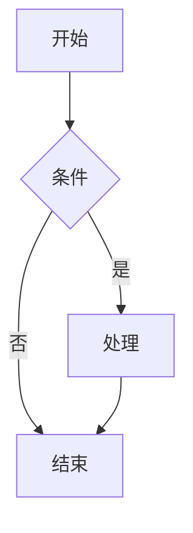
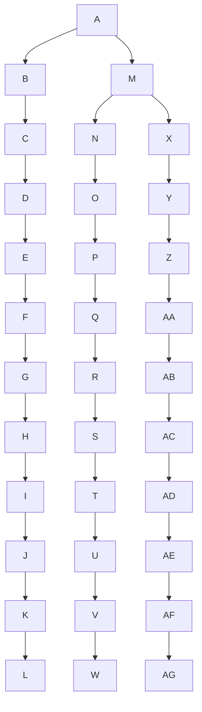

# Mermaid 渲染功能实施计划

> **For agentic workers:** REQUIRED SUB-SKILL: Use superpowers:subagent-driven-development (recommended) or superpowers:executing-plans to implement this plan task-by-task. Steps use checkbox (`- [ ]`) syntax for tracking.

**Goal:** 实现 ` ```mermaid ` 代码块 → 流程图渲染，作为原子内容块集成进 A4 文档与长图文（Card）两个场景；同步把 MathJax 从 CDN 迁移到本地打包 + dynamic import 懒加载。

**Architecture:** 复刻现有 MathJax 的「收集 → 预渲染 → 解析替换」三段式异步管线。mermaid 渲染依赖 DOM，在预渲染阶段用 offscreen 容器一次性渲染成自包含 SVG 字符串，输出纯 HTML 字符串后所有模式零差异复用。保留 `parseMarkdown` 同步签名，新增第 4 参数 `mermaidMap`；新增 `parseMarkdownAsync` 串联预渲染。设计详见 `docs/superpowers/specs/2026-06-18-mermaid-rendering-design.md`。

**Tech Stack:** React 18 + Vite + TypeScript + Tailwind + Zustand；渲染引擎为 `src/engine/` 纯 TS；A4 预览用 Paged.js（iframe）；Card 用固定画布 + useBlockHeights 实测；测试用 Vitest（默认 node 环境，DOM 测试需显式标注 jsdom）。

**关键事实（实施前必读）：**
- 包管理器是 **pnpm**
- `vitest.config.ts` 默认 node 环境，无 jsdom 全局配置——DOM 测试需在文件顶部用 `// @vitest-environment jsdom` 注释声明
- mermaid 最新版 `11.15.0`，mathjax 最新版 `4.1.2`，浏览器入口 `mathjax/es5/tex-svg.js`
- `parseMarkdown(md, t, formulaMap?)` 当前是同步函数，输出纯 HTML 字符串
- `estimateBlockHeight` / `estimateBlockUnits` 的 `switch(kind)` 没有 mermaid 分支会走 default
- `splitMarkdownBlocks` 现有 `avoidBreak: kind !== 'paragraph'`——mermaid 加进 DocumentBlockKind 后自动 avoidBreak=true
- A4 预览路径**不经过 useBlockHeights**，完全靠 Paged.js 在 iframe 内按 CSS 分页；`paginateDocumentBlocks` + `actualHeights` 仅用于离线/DOCX 导出
- `buildPagedContentHtml(blocks, colors, settings)` 是同步函数，内部逐块调 `parseMarkdown(block.markdown, colors)`

---

## 文件结构

**新增文件：**
- `src/engine/utils/mermaidRenderer.ts` — mermaid 懒加载 + 单图渲染（镜像 `mathRenderer.ts`）
- `src/engine/utils/mermaidRenderer.test.ts` — 渲染器单测（jsdom 环境）

**修改文件（按依赖顺序）：**
- `package.json` — 新增 mermaid、mathjax 依赖
- `src/engine/blockParser/types.ts` — DocumentBlockKind 加 `'mermaid'`
- `src/engine/blockParser/classifyBlock.ts` — 识别 mermaid 代码块
- `src/engine/utils/mathRenderer.ts` — loadMathJax 改 dynamic import
- `src/engine/utils/markdownParser.ts` — collectMermaidDiagrams / preRenderMermaid / mermaid 分支 / parseMarkdown 第4参数 / parseMarkdownAsync 串联
- `src/engine/utils/markdownParser.test.ts` — mermaid 分支测试
- `src/engine/index.ts` — 导出新函数
- `src/modes/document/documentModel.ts` — estimateBlockHeight 加 mermaid 分支
- `src/modes/document/documentModel.test.ts` — mermaid 估算测试
- `src/modes/document/paged/pagedContent.ts` — buildPagedContentHtml 接收 mermaidMap
- `src/modes/document/DocumentMode.tsx` — 异步预渲染 mermaidMap + 传入
- `src/modes/document/paged/pagedPageCss.ts` — mermaid 块 CSS
- `src/modes/document/paged/usePagedPreview.ts` — 缩放兜底
- `src/modes/card/cardModel.ts` — estimateBlockUnits 加 mermaid 分支
- `src/modes/card/cardModel.test.ts` — mermaid 估算测试
- `src/modes/card/CardMode.tsx` — 两处 parseMarkdown 调用接入 mermaidMap
- `vite.config.ts` — manualChunks 加 mermaid

---

## Task 1: 安装依赖与基础类型

**Files:**
- Modify: `package.json`
- Modify: `src/engine/blockParser/types.ts`
- Modify: `src/engine/blockParser/classifyBlock.ts`

- [ ] **Step 1: 安装 mermaid 与 mathjax**

```bash
pnpm add mermaid@^11.15.0 mathjax@^4.1.2
```

Expected: `package.json` 的 dependencies 多出 `mermaid` 与 `mathjax`，`pnpm-lock.yaml` 更新。

- [ ] **Step 2: DocumentBlockKind 加 mermaid**

修改 `src/engine/blockParser/types.ts:6-16`，在联合类型中加入 `'mermaid'`：

```typescript
export type DocumentBlockKind =
  | 'heading'
  | 'paragraph'
  | 'image'
  | 'table'
  | 'code'
  | 'mermaid'
  | 'quote'
  | 'list'
  | 'component'
  | 'rule'
  | 'pagebreak'
```

- [ ] **Step 3: classifyBlock 识别 mermaid**

修改 `src/engine/blockParser/classifyBlock.ts:12`，在 `if (/^```/.test(text)) return 'code'` 之前加 mermaid 判断（mermaid 也是围栏代码块，必须先判）：

```typescript
  // mermaid 代码块优先于普通 code 判定（同样是围栏，但语义不同）
  if (/^```mermaid\b/.test(text)) return 'mermaid'
  if (/^```/.test(text)) return 'code'
```

- [ ] **Step 4: 类型检查通过**

Run: `pnpm tsc --noEmit`
Expected: 无错误（新加的 `'mermaid'` 联合成员会让所有 `switch(kind)` 的 default 分支仍能通过，因为没穷尽检查）。

- [ ] **Step 5: Commit**

```bash
git add package.json pnpm-lock.yaml src/engine/blockParser/types.ts src/engine/blockParser/classifyBlock.ts
git commit -m "feat(mermaid): 安装依赖 + DocumentBlockKind 加 mermaid 类型"
```

---

## Task 2: MathJax 迁移到本地打包

**Files:**
- Modify: `src/engine/utils/mathRenderer.ts:15-52`
- Test: 手工验证（无单测，mathRenderer 现有无测试）

**背景**：当前 `loadMathJax` 注入 `<script src="https://cdn.jsdelivr.net/npm/mathjax@3/es5/tex-svg.js">`。改为 dynamic import 本地 `mathjax/es5/tex-svg.js`。注意 mathjax 包导入后会自执行并挂载 `window.MathJax`，但需要**先注入配置再 import**（与原逻辑顺序一致）。

- [ ] **Step 1: 改写 loadMathJax**

修改 `src/engine/utils/mathRenderer.ts`，替换整个 `loadMathJax` 函数（行 15-52）。保留上方的配置注入逻辑（`window.MathJax = { svg: {...}, startup: {...} }`），把 script 注入换成 dynamic import：

```typescript
function loadMathJax(): Promise<void> {
  if (mathJaxReady) return mathJaxReady

  // 在加载 MathJax 前注入配置：fontCache='none' 让路径直接内联，
  // 避免 <use xlink:href> 引用（微信编辑器不支持）
  ;(window as any).MathJax = {
    svg: {
      fontCache: 'none',
    },
    startup: {
      typeset: false,
    },
  }

  mathJaxReady = new Promise<void>((resolve, reject) => {
    if ((window as any).MathJax?.startup?.adaptor) {
      resolve()
      return
    }
    // 本地打包 + dynamic import（替代原 CDN script 注入）：
    // mathjax/es5/tex-svg.js 导入后自执行，按上面注入的配置初始化 window.MathJax
    import('mathjax/es5/tex-svg.js')
      .then(() => {
        const check = setInterval(() => {
          if ((window as any).MathJax?.startup?.adaptor) {
            clearInterval(check)
            resolve()
          }
        }, 50)
      })
      .catch((e) => {
        mathJaxReady = null
        reject(new Error('MathJax load failed: ' + (e as Error)?.message))
      })
  })

  return mathJaxReady
}
```

> 注：`import('mathjax/es5/tex-svg.js')` 没有默认导出（这是浏览器自执行脚本），`.then()` 里不取返回值，只等 `window.MathJax` 就绪。TypeScript 可能报"模块无导出"——需在 `src/vite-env.d.ts` 加声明（见 Step 2）。

- [ ] **Step 2: 加 mathjax 模块类型声明**

修改 `src/vite-env.d.ts`，在文件末尾追加（若文件不存在则在 Task 里新建；先 Read 确认）：

```typescript
// mathjax/es5/tex-svg.js 是浏览器自执行脚本，无 TS 类型，声明为副作用导入
declare module 'mathjax/es5/tex-svg.js'
```

- [ ] **Step 3: 类型检查通过**

Run: `pnpm tsc --noEmit`
Expected: 无错误。

- [ ] **Step 4: 手工验证 MathJax 无回归**

启动 `pnpm dev`，在编辑器输入含公式的文档（如 `$E=mc^2$` 和 `$$\int_0^1 x dx$$`），确认公式正常渲染为 SVG。
Expected: 公式显示与迁移前一致。

- [ ] **Step 5: Commit**

```bash
git add src/engine/utils/mathRenderer.ts src/vite-env.d.ts
git commit -m "refactor(math): MathJax 从 CDN 迁移到本地打包 dynamic import"
```

---

## Task 3: mermaid 渲染器

**Files:**
- Create: `src/engine/utils/mermaidRenderer.ts`
- Create: `src/engine/utils/mermaidRenderer.test.ts`

**背景**：镜像 `mathRenderer.ts` 的懒加载模式。`ensureMermaid` 用 `import('mermaid')` 懒加载，初始化一次。`renderMermaidDiagram(source, containerWidth)` 创建 offscreen div，调 `mermaid.render(id, source, host)`，返回 SVG 字符串。

- [ ] **Step 1: 写失败测试（jsdom 环境）**

创建 `src/engine/utils/mermaidRenderer.test.ts`，文件**首行**必须声明 jsdom 环境（vitest 默认 node）：

```typescript
// @vitest-environment jsdom
import { describe, it, expect, beforeEach } from 'vitest'
import { renderMermaidDiagram, ensureMermaid } from './mermaidRenderer'

describe('renderMermaidDiagram', () => {
  beforeEach(() => {
    // 确保每次测试 document.body 干净（offscreen 容器不留残余）
    document.body.innerHTML = ''
  })

  it('合法 flowchart 渲染出含 svg 的字符串', async () => {
    const { svg, error } = await renderMermaidDiagram(
      'flowchart TD\n  A --> B',
      600,
    )
    expect(error).toBeUndefined()
    expect(svg).toContain('<svg')
  })

  it('合法 sequenceDiagram 渲染出含 svg 的字符串', async () => {
    const { svg, error } = await renderMermaidDiagram(
      'sequenceDiagram\n  Alice->>Bob: Hi',
      600,
    )
    expect(error).toBeUndefined()
    expect(svg).toContain('<svg')
  })

  it('非法语法返回 error 且 svg 为空', async () => {
    const { svg, error } = await renderMermaidDiagram(
      'this is not valid mermaid at all !!!',
      600,
    )
    expect(svg).toBe('')
    expect(error).toBeTruthy()
    expect(typeof error).toBe('string')
  })

  it('offscreen 容器渲染后被移除（DOM 干净）', async () => {
    await renderMermaidDiagram('flowchart TD\n  A --> B', 600)
    // 渲染器内部 host.remove() 后，body 不应残留 mermaid 临时元素
    expect(document.body.querySelector('[id^="m2v-mermaid-"]')).toBeNull()
  })

  it('ensureMermaid 幂等（多次调用返回同一 Promise）', async () => {
    const p1 = ensureMermaid()
    const p2 = ensureMermaid()
    expect(p1).toBe(p2)
    await p1
  })
})
```

- [ ] **Step 2: 运行测试确认失败**

Run: `pnpm vitest run src/engine/utils/mermaidRenderer.test.ts`
Expected: FAIL，错误为 `Cannot find module './mermaidRenderer'`（文件还没建）。

- [ ] **Step 3: 实现 mermaidRenderer**

创建 `src/engine/utils/mermaidRenderer.ts`：

```typescript
/**
 * Mermaid 渲染器 —— 本地打包 dynamic import 懒加载，输出自包含 SVG 字符串。
 *
 * 与 mathRenderer.ts 同构：ensureXxx 懒加载 + renderXxx 单次渲染。
 * mermaid 依赖 DOM，渲染时创建 offscreen 容器，渲染后立即移除。
 */

import type { Mermaid } from 'mermaid'

let mermaidReady: Promise<Mermaid> | null = null

/**
 * 懒加载 mermaid 库（dynamic import → Vite 拆独立 chunk → PWA app-chunks 缓存 → 离线可用）。
 * 幂等：多次调用返回同一 Promise。
 */
export function ensureMermaid(): Promise<Mermaid> {
  if (mermaidReady) return mermaidReady
  mermaidReady = import('mermaid').then((m) => {
    const mermaid = m.default
    mermaid.initialize({
      startOnLoad: false,
      theme: 'neutral', // 中性主题，适配 A4 正式文档与卡片
      securityLevel: 'strict', // 安全：禁用源码中的 html 标签
      flowchart: { useMaxWidth: true }, // 让 mermaid 自适应容器宽度
    })
    return mermaid
  })
  return mermaidReady
}

export interface MermaidRenderResult {
  svg: string
  error?: string
}

/**
 * 把一段 mermaid 源码渲染为自包含 SVG 字符串。
 *
 * @param source mermaid 源码（不含 ```mermaid 围栏）
 * @param containerWidth 内容区像素宽度，用于 mermaid 内部布局自适应换行
 * @returns 成功返回 { svg }；失败返回 { svg: '', error }
 */
export async function renderMermaidDiagram(
  source: string,
  containerWidth: number,
): Promise<MermaidRenderResult> {
  const mermaid = await ensureMermaid()
  // offscreen 容器：宽度=containerWidth，让 mermaid 按真实可用宽排版
  const host = document.createElement('div')
  host.style.cssText = `position:absolute;left:-9999px;top:0;width:${containerWidth}px;visibility:hidden`
  document.body.appendChild(host)
  try {
    const id = `m2v-mermaid-${Math.random().toString(36).slice(2, 10)}`
    const { svg } = await mermaid.render(id, source, host)
    return { svg }
  } catch (e) {
    return { svg: '', error: (e as Error)?.message || '图表渲染失败' }
  } finally {
    host.remove()
  }
}
```

> 注：mermaid v11 的 `render(id, text, container)` 返回 `{ svg, bindFunctions }`。`container` 参数让 mermaid 在指定容器内渲染（用于真实宽度感知）。

- [ ] **Step 4: 运行测试确认通过**

Run: `pnpm vitest run src/engine/utils/mermaidRenderer.test.ts`
Expected: 5 个测试全部 PASS。首次运行会触发 mermaid chunk 加载，可能稍慢（正常）。

- [ ] **Step 5: 类型检查**

Run: `pnpm tsc --noEmit`
Expected: 无错误（mermaid 包自带类型，`import type { Mermaid } from 'mermaid'` 有效）。

- [ ] **Step 6: Commit**

```bash
git add src/engine/utils/mermaidRenderer.ts src/engine/utils/mermaidRenderer.test.ts
git commit -m "feat(mermaid): 新增 mermaid 渲染器（本地懒加载 + offscreen DOM 渲染）"
```

---

## Task 4: markdownParser 集成 mermaid

**Files:**
- Modify: `src/engine/utils/markdownParser.ts`
- Modify: `src/engine/utils/markdownParser.test.ts`
- Modify: `src/engine/index.ts`

**背景**：
- 新增 `collectMermaidDiagrams(md)` —— 扫描 ` ```mermaid ` 围栏，返回 `[{ key, source }]`，key 用源码内容去重（与 collectFormulas 同构）。
- 新增 `preRenderMermaid(diagrams, containerWidth)` —— 批量渲染，返回 `Map<key, { svg, error? }>`。
- `parseMarkdown` 新增第 4 参数 `mermaidMap?`；代码块分支检测 `lang === 'mermaid'`，从 map 取 svg 包成 `<section data-block="mermaid">`，失败降级。
- `parseMarkdownAsync` 串联：collectMermaid → preRenderMermaid → parseMarkdown。

- [ ] **Step 1: 写失败测试**

在 `src/engine/utils/markdownParser.test.ts` 末尾追加 describe 块：

```typescript
import { collectMermaidDiagrams } from './markdownParser'

describe('parseMarkdown - mermaid 集成', () => {
  const colors = makeColors('#2563eb', '#1e40af')

  it('collectMermaidDiagrams 提取 mermaid 源码并按内容去重', () => {
    const md = [
      '```mermaid',
      'flowchart TD',
      '  A --> B',
      '```',
      '',
      '```mermaid',
      'flowchart TD',
      '  A --> B',
      '```',
      '',
      '```mermaid',
      'flowchart TD',
      '  C --> D',
      '```',
    ].join('\n')
    const diagrams = collectMermaidDiagrams(md)
    // 前两段内容相同 → 去重为 1；第三段不同 → 共 2 个
    expect(diagrams).toHaveLength(2)
    expect(diagrams[0].source).toContain('A --> B')
    expect(diagrams[1].source).toContain('C --> D')
  })

  it('传入 mermaidMap 时 mermaid 块替换为 data-block="mermaid"', () => {
    const source = 'flowchart TD\n  A --> B'
    const key = `m:${source}`
    const map = new Map<string, { svg: string; error?: string }>([
      [key, { svg: '<svg>fake-diagram</svg>' }],
    ])
    const md = '```mermaid\n' + source + '\n```'
    const html = parseMarkdown(md, colors, undefined, map)
    expect(html).toContain('data-block="mermaid"')
    expect(html).toContain('<svg>fake-diagram</svg>')
    expect(html).toContain('m2v-mermaid-figure')
  })

  it('不传 mermaidMap 时 mermaid 块降级为代码块', () => {
    const md = '```mermaid\nflowchart TD\n  A --> B\n```'
    const html = parseMarkdown(md, colors)
    expect(html).not.toContain('data-block="mermaid"')
    expect(html).toContain('data-block="code"')
  })

  it('mermaidMap 中有 error 时降级为错误提示 + 代码块', () => {
    const source = 'invalid syntax'
    const key = `m:${source}`
    const map = new Map<string, { svg: string; error?: string }>([
      [key, { svg: '', error: '语法错误示例' }],
    ])
    const md = '```mermaid\n' + source + '\n```'
    const html = parseMarkdown(md, colors, undefined, map)
    expect(html).toContain('data-block="mermaid-error"')
    expect(html).toContain('语法错误示例')
    expect(html).toContain('data-block="code"')
  })
})
```

- [ ] **Step 2: 运行测试确认失败**

Run: `pnpm vitest run src/engine/utils/markdownParser.test.ts -t "mermaid 集成"`
Expected: FAIL，`collectMermaidDiagrams is not defined` / `parseMarkdown 不接受第 4 参数`。

- [ ] **Step 3: 实现 collectMermaidDiagrams 与 preRenderMermaid**

在 `src/engine/utils/markdownParser.ts` 顶部 import 区（约第 7 行 `import { renderMath } from './mathRenderer'` 后）加：

```typescript
import { renderMermaidDiagram } from './mermaidRenderer'
```

在 `preRenderFormulas` 函数（约行 172）之后、`parseMarkdownAsync` 之前，插入两个新函数：

```typescript
/**
 * 收集 md 中所有 mermaid 代码块源码（按内容去重），用于预渲染。
 * 与 collectFormulas 同构。key 格式：`m:${source}`。
 */
export function collectMermaidDiagrams(md: string): Array<{ key: string; source: string }> {
  const seen = new Set<string>()
  const result: Array<{ key: string; source: string }> = []
  // 匹配 ```mermaid 围栏（支持 ```mermaid 后跟空格/换行）
  const re = /```mermaid[ \t]*\r?\n([\s\S]*?)```/g
  let m: RegExpExecArray | null
  while ((m = re.exec(md)) !== null) {
    const source = m[1].replace(/\s+$/, '')
    const key = `m:${source}`
    if (!seen.has(key)) {
      seen.add(key)
      result.push({ key, source })
    }
  }
  return result
}

/**
 * 批量预渲染 mermaid 源码为 SVG。
 * @returns Map<key, { svg, error? }>。失败项 svg 为空字符串、error 非空。
 */
export async function preRenderMermaid(
  diagrams: Array<{ key: string; source: string }>,
  containerWidth: number,
): Promise<Map<string, { svg: string; error?: string }>> {
  const map = new Map<string, { svg: string; error?: string }>()
  const results = await Promise.all(
    diagrams.map(async (d) => {
      const r = await renderMermaidDiagram(d.source, containerWidth)
      return { key: d.key, ...r }
    }),
  )
  for (const { key, svg, error } of results) {
    map.set(key, { svg, error })
  }
  return map
}
```

- [ ] **Step 4: 改 parseMarkdown 签名与 mermaid 分支**

修改 `src/engine/utils/markdownParser.ts` 中 `parseMarkdown` 的签名（行 184）：

```typescript
export function parseMarkdown(
  md: string,
  t: ThemeColors,
  formulaMap?: Map<string, string>,
  mermaidMap?: Map<string, { svg: string; error?: string }>,
): string {
```

修改代码块分支（行 562-574）。当前是：

```typescript
    // 代码块
    if (/^```/.test(line)) {
      const lang = line.replace(/^```/, '').trim()
      i++
      let code = ''
      while (i < lines.length && !/^```/.test(lines[i])) {
        code += lines[i] + '\n'
        i++
      }
      i++
      html += renderCodeBlock(code, lang)
      continue
    }
```

改为（在 renderCodeBlock 之前插入 mermaid 判断）：

```typescript
    // 代码块
    if (/^```/.test(line)) {
      const lang = line.replace(/^```/, '').trim()
      i++
      let code = ''
      while (i < lines.length && !/^```/.test(lines[i])) {
        code += lines[i] + '\n'
        i++
      }
      i++
      // mermaid 代码块：从预渲染 map 取 SVG，失败或不传 map 时降级
      if (lang === 'mermaid') {
        const source = code.replace(/\s+$/, '')
        const entry = mermaidMap?.get(`m:${source}`)
        if (entry?.svg) {
          html += `<section data-block="mermaid" style="max-width:100%;margin:16px auto;text-align:center;break-inside:avoid"><div class="m2v-mermaid-figure" style="display:inline-block;max-width:100%;max-height:var(--m2v-mermaid-max-height,none);overflow:hidden">${entry.svg}</div></section>`
        } else if (entry?.error) {
          html += `<section data-block="mermaid-error" style="background:rgb(254,242,242);border-left:3px solid rgb(220,80,80);padding:10px 14px;margin:14px 0;font-size:12.5px;color:rgb(120,30,30)">图表渲染失败：${esc(entry.error)}</section>`
          html += renderCodeBlock(code, 'mermaid')
        } else {
          // 未传 mermaidMap（如 Article 同步路径）→ 降级为代码块
          html += renderCodeBlock(code, 'mermaid')
        }
      } else {
        html += renderCodeBlock(code, lang)
      }
      continue
    }
```

- [ ] **Step 5: 改 parseMarkdownAsync 串联 mermaid 预渲染**

修改 `parseMarkdownAsync`（行 178-182）。当前：

```typescript
export async function parseMarkdownAsync(md: string, t: ThemeColors): Promise<string> {
  const formulas = collectFormulas(md)
  const formulaMap = formulas.length > 0 ? await preRenderFormulas(formulas) : undefined
  return parseMarkdown(md, t, formulaMap)
}
```

改为：

```typescript
export async function parseMarkdownAsync(
  md: string,
  t: ThemeColors,
  containerWidth = 578,
): Promise<string> {
  const formulas = collectFormulas(md)
  const formulaMap = formulas.length > 0 ? await preRenderFormulas(formulas) : undefined
  const diagrams = collectMermaidDiagrams(md)
  const mermaidMap =
    diagrams.length > 0 ? await preRenderMermaid(diagrams, containerWidth) : undefined
  return parseMarkdown(md, t, formulaMap, mermaidMap)
}
```

> `containerWidth` 默认 578（与原 Article 宽一致），A4/Card 调用方显式传入。

- [ ] **Step 6: 运行测试确认通过**

Run: `pnpm vitest run src/engine/utils/markdownParser.test.ts`
Expected: 所有测试 PASS（含原有 caption 测试 + 新增 4 个 mermaid 测试）。

- [ ] **Step 7: 导出新函数**

修改 `src/engine/index.ts:3`，把 mermaid 相关函数加入导出。当前：

```typescript
export { parseMarkdown, parseMarkdownAsync, collectFormulas, preRenderFormulas } from './utils/markdownParser'
```

改为：

```typescript
export {
  parseMarkdown,
  parseMarkdownAsync,
  collectFormulas,
  preRenderFormulas,
  collectMermaidDiagrams,
  preRenderMermaid,
} from './utils/markdownParser'
export { renderMermaidDiagram, ensureMermaid } from './utils/mermaidRenderer'
```

- [ ] **Step 8: 类型检查**

Run: `pnpm tsc --noEmit`
Expected: 无错误。

- [ ] **Step 9: Commit**

```bash
git add src/engine/utils/markdownParser.ts src/engine/utils/markdownParser.test.ts src/engine/index.ts
git commit -m "feat(mermaid): markdownParser 集成 mermaid 预渲染管线"
```

---

## Task 5: documentModel / cardModel 估算

**Files:**
- Modify: `src/modes/document/documentModel.ts:91-121`
- Modify: `src/modes/document/documentModel.test.ts`
- Modify: `src/modes/card/cardModel.ts:38-62`
- Modify: `src/modes/card/cardModel.test.ts`

**背景**：`estimateBlockHeight` 和 `estimateBlockUnits` 的 switch 没有 mermaid 分支。给保守默认值（离线/DOCX 路径用，不影响预览）。

- [ ] **Step 1: documentModel estimateBlockHeight 加 mermaid 分支**

修改 `src/modes/document/documentModel.ts` 的 `estimateBlockHeight` 函数，在 `case 'code':` 之前加：

```typescript
    case 'mermaid':
      return 280 // 保守估算：一个中等流程图 + 说明文字行（实测在 Paged.js 路径不依赖此值）
```

- [ ] **Step 2: documentModel 加测试**

在 `src/modes/document/documentModel.test.ts` 末尾追加（先 Read 该文件确认 import 与现有结构）：

```typescript
import { splitMarkdownBlocks } from './documentModel'

describe('estimateBlockHeight - mermaid', () => {
  it('mermaid 块估算高度为 280', () => {
    const md = '```mermaid\nflowchart TD\n  A --> B\n```'
    const blocks = splitMarkdownBlocks(md)
    expect(blocks[0].kind).toBe('mermaid')
    expect(blocks[0].estimatedHeight).toBe(280)
  })

  it('mermaid 块默认 avoidBreak（原子块）', () => {
    const md = '```mermaid\nflowchart TD\n  A --> B\n```'
    const blocks = splitMarkdownBlocks(md)
    expect(blocks[0].avoidBreak).toBe(true)
  })
})
```

- [ ] **Step 3: cardModel estimateBlockUnits 加 mermaid 分支**

修改 `src/modes/card/cardModel.ts` 的 `estimateBlockUnits` 函数，在 `case 'code':` 之前加：

```typescript
    case 'mermaid':
      return 12 // 卡片中一个流程图约占用 12 个内容单位（约半页）
```

- [ ] **Step 4: cardModel 加测试**

在 `src/modes/card/cardModel.test.ts` 末尾追加（先 Read 确认 import）：

```typescript
describe('estimateBlockUnits - mermaid', () => {
  it('mermaid 块估算单位为 12', () => {
    // 通过 classifyBlock 间接验证（estimateBlockUnits 内部调 classifyBlock）
    const { classifyBlock } = require('@/engine/blockParser')
    const block = '```mermaid\nflowchart TD\n  A --> B\n```'
    expect(classifyBlock(block)).toBe('mermaid')
  })
})
```

> 注：`estimateBlockUnits` 未导出，这里通过 classifyBlock 验证 mermaid 被正确识别（已在 Task 1 覆盖）。如果该测试与 Task 1 重复，可改为测试 `createCardModel` 含 mermaid 块时 pages 正确切分——但 mermaid 在 Card 的真实高度靠 useBlockHeights 实测，estimateBlockUnits 仅用于无实测时的兜底。**决策**：此测试可省略，因为 Task 1 的 classifyBlock 测试已覆盖。**跳过 Step 4，不新增 cardModel 测试。**

- [ ] **Step 5: 运行测试**

Run: `pnpm vitest run src/modes/document/documentModel.test.ts`
Expected: 含新增 mermaid 估算测试，全部 PASS。

- [ ] **Step 6: 类型检查**

Run: `pnpm tsc --noEmit`
Expected: 无错误。

- [ ] **Step 7: Commit**

```bash
git add src/modes/document/documentModel.ts src/modes/document/documentModel.test.ts src/modes/card/cardModel.ts
git commit -m "feat(mermaid): documentModel/cardModel 高度估算加 mermaid 分支"
```

---

## Task 6: A4 模式接入（pagedContent + DocumentMode）

**Files:**
- Modify: `src/modes/document/paged/pagedContent.ts`
- Modify: `src/modes/document/DocumentMode.tsx`

**背景**：
- `buildPagedContentHtml` 是同步函数，内部逐块调 `parseMarkdown(block.markdown, colors)`。改为接收预构建好的 `mermaidMap`，传给 `parseMarkdown`。
- `DocumentMode` 的 `contentHtml` useMemo 是同步的。改为：新增一个异步 `useEffect` 预渲染 `mermaidMap`，存入 state；`contentHtml` useMemo 依赖该 state，map 就绪后才生成完整 HTML（map 未就绪时传 undefined，mermaid 块暂时降级为代码块，就绪后重渲染）。

**A4 containerWidth 计算**：`settings.pageWidth - settings.marginLeft - settings.marginRight`（默认 794 - 72*2 = 650）。

- [ ] **Step 1: buildPagedContentHtml 接收 mermaidMap**

修改 `src/modes/document/paged/pagedContent.ts`。

先改 import（行 1）：
```typescript
import { parseMarkdown, type ThemeColors } from '@engine'
```
改为（加 MermaidMap 类型）：
```typescript
import { parseMarkdown, type ThemeColors } from '@engine'

export type MermaidMap = Map<string, { svg: string; error?: string }>
```

改 `buildPagedContentHtml` 签名（行 61-65），加 `mermaidMap` 参数：
```typescript
export function buildPagedContentHtml(
  blocks: DocumentBlock[],
  colors: ThemeColors,
  settings: PagedContentSettings,
  mermaidMap?: MermaidMap,
): string {
```

改 `renderBlock` 内部（行 72-82），把 `parseMarkdown(block.markdown, colors)` 改为传 mermaidMap：
```typescript
  const renderBlock = (block: DocumentBlock): string => {
    let inner = parseMarkdown(block.markdown, colors, undefined, mermaidMap)
    if (block.kind === 'table') inner = normalizeTableHtml(inner)

    const classes = ['document-block']
    if (block.id === firstHeadingId) classes.push('document-title-block')
    if (block.kind === 'code' && block.markdown.split('\n').length < CODE_ATOMIC_MAX_LINES) {
      classes.push('document-code-atomic')
    }
    return `<section class="${classes.join(' ')}" data-kind="${block.kind}">${inner}</section>`
  }
```

- [ ] **Step 2: DocumentMode 异步预渲染 mermaidMap**

修改 `src/modes/document/DocumentMode.tsx`。

先在 import 区加（约行 12 附近，与其他 engine import 一起）：
```typescript
import { collectMermaidDiagrams, preRenderMermaid } from '@engine'
import type { MermaidMap } from './paged/pagedContent'
```

在 `contentHtml` useMemo **之前**（约行 88），新增 state + effect 预渲染 mermaidMap：

```typescript
  // mermaid 预渲染：collectMermaidDiagrams → preRenderMermaid → 存入 state
  // contentHtml 依赖此 map，map 就绪后 mermaid 块才正确渲染（就绪前降级为代码块）
  const [mermaidMap, setMermaidMap] = useState<MermaidMap | undefined>(undefined)
  useEffect(() => {
    const diagrams = collectMermaidDiagrams(contentMarkdown)
    if (diagrams.length === 0) {
      setMermaidMap(undefined)
      return
    }
    const width = settings.pageWidth - settings.marginLeft - settings.marginRight
    let cancelled = false
    preRenderMermaid(diagrams, width).then((map) => {
      if (!cancelled) setMermaidMap(map)
    })
    return () => {
      cancelled = true
    }
  }, [contentMarkdown, settings.pageWidth, settings.marginLeft, settings.marginRight])
```

修改 `contentHtml` useMemo（行 88-97），传入 mermaidMap：

```typescript
  const contentHtml = useMemo(
    () =>
      buildPagedContentHtml(blocks, colors, {
        fontFamily: settings.fontFamily,
        fontScale: settings.fontScale,
        centerTitle: settings.centerTitle,
        indentParagraph: settings.indentParagraph,
      }, mermaidMap),
    [blocks, colors, settings.fontFamily, settings.fontScale, settings.centerTitle, settings.indentParagraph, mermaidMap],
  )
```

> 确认 `useState`、`useEffect` 已在文件顶部从 'react' 导入（先 Read 文件确认）。

- [ ] **Step 3: 类型检查**

Run: `pnpm tsc --noEmit`
Expected: 无错误。

- [ ] **Step 4: 手工验证 A4 mermaid 基本渲染**

启动 `pnpm dev`，在 A4 文档模式输入：

```markdown
# 测试文档

正文段落。



后续正文。
```

Expected: mermaid 块渲染为流程图（中性灰色），水平居中，与正文共页；不报错。

- [ ] **Step 5: Commit**

```bash
git add src/modes/document/paged/pagedContent.ts src/modes/document/DocumentMode.tsx
git commit -m "feat(mermaid): A4 文档接入 mermaid 预渲染（异步 mermaidMap + 传入 buildPagedContentHtml）"
```

---

## Task 7: A4 模式 CSS 与缩放兜底

**Files:**
- Modify: `src/modes/document/paged/pagedPageCss.ts`
- Modify: `src/modes/document/paged/usePagedPreview.ts`

**背景**：
- pagedPageCss 注入 mermaid 块的 break-inside:avoid + max-height/scale CSS 变量。
- usePagedPreview 渲染完成后（`flow.total` 回来后），遍历 iframe 内 mermaid 块，若超高则计算 scale 写入 CSS 变量。

**可用高计算**：`pageHeight - marginTop - marginBottom`（与 buildPageCss 的 contentHeight 同源；@page margin 已含 header/footer 空间，Paged.js 的可用内容高就是这个）。

- [ ] **Step 1: pagedPageCss 加 mermaid 块规则**

修改 `src/modes/document/paged/pagedPageCss.ts` 的 `buildPageCss`，在表格跨页规则（约行 96-98）之后追加：

```typescript
/* ===== mermaid 图：原子块 + 超高缩放兜底 ===== */
.document-content .document-block[data-kind='mermaid'] {
  break-inside: avoid !important;
  page-break-inside: avoid !important;
}
.document-content .document-block[data-kind='mermaid'] .m2v-mermaid-figure {
  transform: scale(var(--m2v-mermaid-scale, 1));
  transform-origin: top center;
}
```

> 注意：`max-height` 不写在 CSS 里（默认 none），由 usePagedPreview 在 JS 中按需设 `--m2v-mermaid-max-height`，避免图矮时被裁。

- [ ] **Step 2: usePagedPreview 加缩放兜底**

修改 `src/modes/document/paged/usePagedPreview.ts`。

先扩展 `UsePagedPreviewParams` 接口（行 6-18），加 `availableHeight`：

```typescript
interface UsePagedPreviewParams {
  iframeRef: React.RefObject<HTMLIFrameElement | null>
  /** 待分页的内容 HTML（由 buildPagedContentHtml 生成） */
  contentHtml: string
  /** @page 等分页样式（由 buildPageCss 生成） */
  pageCss: string
  /** 文档标题，用于打印对话框默认文件名 */
  title: string
  /** 屏幕预览缩放（适配预览面板宽度，打印时忽略） */
  fitScale: number
  /** 重排防抖毫秒 */
  debounceMs?: number
  /** 单页可用内容高（px）= pageHeight - marginTop - marginBottom，用于 mermaid 超高缩放兜底 */
  availableHeight?: number
}
```

在解构参数处（行 27-34）加 `availableHeight`：

```typescript
export function usePagedPreview({
  iframeRef,
  contentHtml,
  pageCss,
  title,
  fitScale,
  debounceMs = 350,
  availableHeight,
}: UsePagedPreviewParams): UsePagedPreviewResult {
```

新增缩放函数（在 `resizeToContent` 之后，`renderNow` 之前插入）：

```typescript
  // mermaid 超高缩放兜底：渲染完成后遍历 iframe 内 mermaid 块，若超高则设 CSS 变量缩放。
  // 说明文字（caption）行高约 36px，预留后才是图的实际可用高。
  const scaleMermaidBlocks = useCallback(() => {
    if (!availableHeight) return
    const doc = iframeRef.current?.contentDocument
    if (!doc) return
    const CAPTION_LINE = 36
    const maxH = availableHeight - CAPTION_LINE
    const figures = doc.querySelectorAll<HTMLElement>(
      '.document-block[data-kind="mermaid"] .m2v-mermaid-figure',
    )
    figures.forEach((fig) => {
      const block = fig.closest('.document-block') as HTMLElement | null
      // 测整个块（含外层 section margin）的高度，判断是否超页
      const blockH = block ? block.offsetHeight : fig.offsetHeight
      if (blockH > availableHeight) {
        const scale = Math.max(0.3, Math.min(1, maxH / fig.offsetHeight))
        fig.style.setProperty('--m2v-mermaid-scale', String(scale))
        fig.style.setProperty('--m2v-mermaid-max-height', `${maxH}px`)
      } else {
        fig.style.removeProperty('--m2v-mermaid-scale')
        fig.style.removeProperty('--m2v-mermaid-max-height')
      }
    })
  }, [iframeRef, availableHeight])
```

在 `renderNow` 的 `.then` 回调里（行 74-81），`resizeToContent()` 之后加 `scaleMermaidBlocks()`：

```typescript
      .then((total: number) => {
        setPageCount(total || 0)
        setStatus('done')
        requestAnimationFrame(() => {
          applyFit()
          scaleMermaidBlocks()
          resizeToContent()
        })
      })
```

- [ ] **Step 3: DocumentMode 传入 availableHeight**

修改 `src/modes/document/DocumentMode.tsx` 的 `usePagedPreview` 调用（行 105-111），加 `availableHeight`：

```typescript
  const { status, pageCount, print } = usePagedPreview({
    iframeRef,
    contentHtml,
    pageCss,
    title: filename.replace(/\.pdf$/, ''),
    fitScale,
    availableHeight: settings.pageHeight - settings.marginTop - settings.marginBottom,
  })
```

- [ ] **Step 4: 类型检查**

Run: `pnpm tsc --noEmit`
Expected: 无错误。

- [ ] **Step 5: 手工验证 A4 缩放与说明文字**

在 A4 文档模式输入一个大流程图（会超过单页），验证：

```markdown
# 大图测试



图 1：复杂业务流程示意图
```

Expected: 流程图等比缩小后不超过一页；说明文字「图 1：复杂业务流程示意图」以 caption 样式居中显示。

- [ ] **Step 6: Commit**

```bash
git add src/modes/document/paged/pagedPageCss.ts src/modes/document/paged/usePagedPreview.ts src/modes/document/DocumentMode.tsx
git commit -m "feat(mermaid): A4 模式 CSS 规则 + 超高缩放兜底"
```

---

## Task 8: Card 模式接入

**Files:**
- Modify: `src/modes/card/CardMode.tsx`

**背景**：Card 有两处调 `parseMarkdown`：
- `:151` 展示卡片（每页 markdown → HTML）
- `:437` 隐藏测量容器（每个 block → HTML）

两处都需接收预渲染好的 mermaidMap。Card containerWidth = `ASPECTS[aspect].w - 2 * PAD_X`（需从 xhsCards 导入常量，或直接算）。

**关键**：CardMode 已有 `useBlockHeights` 测量。mermaidMap 必须在测量和展示前就绪——和 A4 一样用 state + 异步预渲染。

- [ ] **Step 1: 确认 CardMode 现有结构与常量**

Run: `pnpm tsc --noEmit`（确认基线无错）
Read `src/modes/card/CardMode.tsx` 行 1-50 与 414-441，确认：
- `contentMarkdown` 变量来源（用于 collectMermaidDiagrams）
- `aspect` 变量
- `ASPECTS` / `PAD_X` 是否已导入（若未导入，从 `@/engine/utils/xhsCards` 导入）

- [ ] **Step 2: CardMode 接入 mermaidMap**

修改 `src/modes/card/CardMode.tsx`。

import 区加（约行 8）：
```typescript
import { parseMarkdown, collectMermaidDiagrams, preRenderMermaid, type ThemeColors } from "@engine";
```
（替换原 `import { parseMarkdown, type ThemeColors } from "@engine";`）

从 xhsCards 导入常量（若未导入，在现有 xhsCards import 处补）：
```typescript
import { ASPECTS, PAD_X } from '@/engine/utils/xhsCards'
```

在 `useBlockHeights` 调用（行 112）**之前**，新增 mermaidMap 预渲染 state + effect（需确认 `contentMarkdown` 变量名——若 Card 用 `model.contentMarkdown` 则用之）：

```typescript
  // mermaid 预渲染：与 A4 同构
  const [mermaidMap, setMermaidMap] = useState<Map<string, { svg: string; error?: string }> | undefined>(undefined)
  useEffect(() => {
    const md = model.contentMarkdown
    const diagrams = collectMermaidDiagrams(md)
    if (diagrams.length === 0) {
      setMermaidMap(undefined)
      return
    }
    const width = ASPECTS[aspect].w - 2 * PAD_X
    let cancelled = false
    preRenderMermaid(diagrams, width).then((map) => {
      if (!cancelled) setMermaidMap(map)
    })
    return () => { cancelled = true }
  }, [model.contentMarkdown, aspect])
```

修改展示卡片渲染（行 150-158），`parseMarkdown(page.markdown, colors)` 改为传 mermaidMap：

```typescript
        html: buildContentCard(
          parseMarkdown(page.markdown, colors, undefined, mermaidMap),
          aspect,
          index + 1,
          total,
          finalBrand,
          colors,
          getFontFamilyCss(cardFont),
        ),
```

并把 `mermaidMap` 加入该 useMemo 的依赖数组（约行 161）。

修改隐藏测量容器（行 437），`parseMarkdown(block, colors)` 改为：

```typescript
                    __html: parseMarkdown(block, colors, undefined, mermaidMap),
```

确认 `useState`、`useEffect` 已从 'react' 导入（CardMode 顶部应有；若没有则补）。

- [ ] **Step 3: 类型检查**

Run: `pnpm tsc --noEmit`
Expected: 无错误。

- [ ] **Step 4: 手工验证 Card mermaid 渲染**

启动 `pnpm dev`，切到长图文模式输入含 mermaid 的内容：

```markdown
# 流程示意


图 1：处理流程
```

Expected: mermaid 图在内容卡中渲染，水平居中，不超单页；测量容器与展示卡片渲染一致（不会出现测量时是代码块、展示时是图的不一致）。

- [ ] **Step 5: Commit**

```bash
git add src/modes/card/CardMode.tsx
git commit -m "feat(mermaid): Card 长图文接入 mermaid 预渲染（展示卡片 + 测量容器）"
```

---

## Task 9: vite 配置与最终验证

**Files:**
- Modify: `vite.config.ts`

- [ ] **Step 1: vite manualChunks 加 mermaid**

修改 `vite.config.ts:69-79` 的 `manualChunks`，加 mermaid 独立 chunk：

```typescript
        manualChunks: {
          'react-vendor': ['react', 'react-dom'],
          'codemirror-vendor': [
            '@codemirror/language',
            '@codemirror/lang-markdown',
            '@codemirror/lang-html',
            '@uiw/react-codemirror',
            'codemirror'
          ],
          'engine-vendor': ['highlight.js', 'katex'],
          'mermaid-vendor': ['mermaid'],
          'mathjax-vendor': ['mathjax'],
        }
```

> 注：mathjax 因 dynamic import 本就会拆 chunk，但显式声明 manualChunks 可避免与其他 vendor 混杂。

- [ ] **Step 2: 全量类型检查 + 测试**

Run:
```bash
pnpm tsc --noEmit
pnpm vitest run
```
Expected: 类型无错；所有测试 PASS（含原有测试 + 新增 mermaid/mathjax 相关）。

- [ ] **Step 3: 构建验证**

Run: `pnpm build`
Expected: 构建成功；`dist/assets/` 下出现 `mermaid-vendor-*.js` 与 `mathjax-vendor-*.js`（或被 dynamic import 拆成独立 hash 文件）；无 chunk 超大告警（mermaid chunk 会触发默认 700kb 告警，可接受，或调高 chunkSizeWarningLimit）。

- [ ] **Step 4: 离线验证**

启动 `pnpm dev`，打开应用，写一个含 mermaid + 公式的文档，确认渲染正常后：
- DevTools → Application → Service Workers → Offline 勾选
- 刷新页面
Expected: mermaid 图与数学公式仍正常渲染（依赖 PWA app-chunks 缓存 + 本地 dynamic import）。

- [ ] **Step 5: 失败降级验证**

在编辑器输入错误的 mermaid 语法：

```markdown
```mermaid
this is not valid mermaid syntax !!!
```
```

Expected: 显示红色错误提示条（「图表渲染失败：...」）+ 紧跟 mermaid 源码代码块。

- [ ] **Step 6: Commit**

```bash
git add vite.config.ts
git commit -m "build(mermaid): vite manualChunks 拆分 mermaid/mathjax 独立 chunk"
```

---

## 验收清单

实施完成后，逐项确认（对应 spec §1.2 硬约束）：

- [ ] mermaid 图作为整块永不跨页（A4 / Card 均不拆分）
- [ ] A4：图 + 一行说明文字合计不超一页（超大图缩放兜底）
- [ ] Card：图不超单页
- [ ] 离线可用（断网后 mermaid + 公式仍渲染）
- [ ] 失败降级为代码块 + 错误提示
- [ ] 说明文字复用 caption 机制（与图片一致）
- [ ] 缩放策略：mermaid 自适应 + CSS scale 兜底
- [ ] 图低于可用区时按自然尺寸水平居中，不强制撑满
- [ ] MathJax 迁移无回归（现有公式文档渲染一致）
